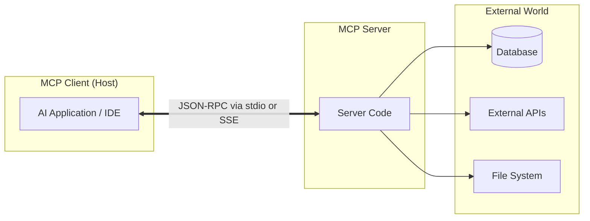

# Model Context Protocol (MCP) - Master Reference Guide

Welcome to the **Model Context Protocol (MCP)** master guide. This document serves as an offline-friendly reference for understanding the architecture, features, and implementation patterns of MCP.

---

## 🌟 What is MCP? (The "USB-C" of AI)

The **Model Context Protocol (MCP)** is an open-source standard created to establish a secure, uniform connection between AI models (Large Language Models, or LLMs) and external systems. 

Historically, developers had to write custom, ad-hoc integrations for every tool, database, API, and platform they wanted an LLM to interact with. MCP standardizes this connection, acting as a universal port (similar to how USB-C standardizes connections for keyboards, monitors, and power cables).

---

## 🏗️ Core Architecture

MCP operates as a client-server architecture with three primary roles:



1. **Host (AI Application)**:
   The application where the user interacts with the AI (e.g., Claude Desktop, Cursor, or your IDE shell). It acts as the orchestrator.
2. **MCP Client**:
   The component inside the Host that establishes a protocol connection to the MCP Server, translates user prompts into tool requests, and returns tool outputs to the model.
3. **MCP Server**:
   A lightweight process (written in TypeScript, Node, Python, etc.) that runs locally or remotely. It registers specific capabilities and interacts directly with local files, databases, or third-party web APIs.

---

## 🛠️ The Three Pillars of MCP Capabilities

An MCP server can expose three primary interfaces to the client:

### 1. Resources (Read-Only Data)
Resources allow servers to share files, database schemas, raw texts, or API responses with the LLM. 
- **Use Case**: Providing a log file, schema dictionary, or git diff.
- **URI Scheme**: Resources are identified by standard URIs (e.g., `file://log.txt`, `postgres://users/schema`).
- **Templates**: Dynamic resources can be created using templates (e.g., `git://commit/{hash}`).

### 2. Prompts (AI Checklists / Templates)
Prompts are pre-defined templates that guide the LLM's behavior or format instructions.
- **Use Case**: A code review prompt, bug analysis template, or language translation frame.
- **Arguments**: Prompts can take variables (e.g., `{code_to_review}`) which are filled in before sending to the model.

### 3. Tools (Read-Write Actions)
Tools are executable functions that allow the LLM to modify states or take actions. They require user approval before running for safety.
- **Use Case**: Creating a file, running a shell command, searching Google, or calling a Slack API.
- **Input Schema**: Defined using standard JSON Schema so the LLM knows what arguments to pass.

---

## 📡 Transports: How Clients & Servers Talk

Communication happens using standard **JSON-RPC 2.0** messages. MCP currently supports two main transport layers:

| Transport Type | How it Works | Primary Use Case |
| :--- | :--- | :--- |
| **`stdio`** (Standard I/O) | Uses the console's standard input and standard output stream. | Local development, desktop editors, and local CLI tools. |
| **`SSE`** (Server-Sent Events) | Uses HTTP connections where the server streams events to the client. | Remote services, cloud integrations, and browser-based hosts. |

---

## ⚡ Quick-Start: Build a Simple Node/TypeScript MCP Server

Here is a minimal TypeScript MCP server that exposes a single math tool.

### 1. Initialize Project
```bash
npm init -y
npm install @modelcontextprotocol/sdk
```

### 2. Implementation (`index.ts`)
```typescript
import { Server } from "@modelcontextprotocol/sdk/server/index.js";
import { StdioServerTransport } from "@modelcontextprotocol/sdk/server/stdio.js";
import {
  CallToolRequestSchema,
  ListToolsRequestSchema,
} from "@modelcontextprotocol/sdk/types.js";

// Initialize the MCP Server
const server = new Server(
  {
    name: "calculator-mcp-server",
    version: "1.0.0",
  },
  {
    capabilities: {
      tools: {}, // Enable tools capability
    },
  }
);

// Register the tool definitions
server.setRequestHandler(ListToolsRequestSchema, async () => {
  return {
    tools: [
      {
        name: "calculate_sum",
        description: "Adds two numbers together.",
        inputSchema: {
          type: "object",
          properties: {
            a: { type: "number", description: "First number" },
            b: { type: "number", description: "Second number" },
          },
          required: ["a", "b"],
        },
      },
    ],
  };
});

// Handle tool execution requests
server.setRequestHandler(CallToolRequestSchema, async (request) => {
  if (request.params.name === "calculate_sum") {
    const a = request.params.arguments?.a as number;
    const b = request.params.arguments?.b as number;

    return {
      content: [
        {
          type: "text",
          text: JSON.stringify({ result: a + b }),
        },
      ],
    };
  }
  throw new Error(`Tool ${request.params.name} not found`);
});

// Start the server using stdio transport
async function main() {
  const transport = new StdioServerTransport();
  await server.connect(transport);
  console.error("Calculator MCP Server running on stdio");
}

main().catch(console.error);
```

### 3. Connect the Server to Client Config
Add your server to the host's configuration file (e.g., `claude_desktop_config.json`):
```json
{
  "mcpServers": {
    "calculator": {
      "command": "node",
      "args": ["/absolute/path/to/dist/index.js"]
    }
  }
}
```

---

## 🛡️ Best Practices for MCP Developers

- **Always Validate Inputs**: Tools can receive arbitrary JSON from LLMs. Validate inputs using schemas or runtime checkers like `zod`.
- **Log via Stderr**: If using `stdio` transport, printing normal debug logs via `console.log()` will break the JSON-RPC communication stream. Direct all logging output to `console.error()`.
- **Keep it Stateless**: Treat servers as stateless pipelines. Rely on client contexts or local files for persistent storage.
- **Request Narrowest Scopes**: Limit database schemas or file structures exposed to the model to avoid exposing sensitive secrets.
